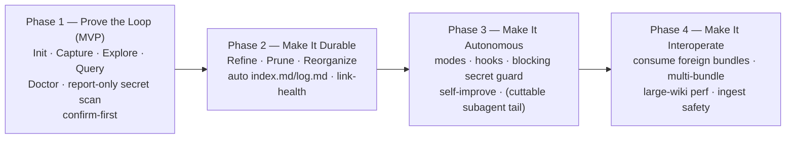

# Phase Plan — `/llm-wiki`: phasing & Claude Code primitive mapping

> Companion to [`PRODUCT_PLAN.md`](./PRODUCT_PLAN.md). That document defines *what* the plugin is
> and how it behaves; this one decides **how many phases, what lands in each, and which Claude Code
> primitive implements each part**. Still pre-implementation: a per-phase *technical* plan (manifest,
> file-writing behaviors, exact command/skill/hook contracts) is written and reviewed before code.
>
> Produced via a multi-agent pass (3 independent phase proposals → synthesis → primitive mapping →
> adversarial verification across OKF-conformance / primitive-fit / completeness lenses). Conformance
> claims below were re-verified against [`reference/okf_spec.md`](./reference/okf_spec.md).

---

## Headline

**Four phases.** The product is a loop — **author → read → maintain → self-improve → interoperate** —
shipped one layer at a time, each independently usable, each farther from the core loop and higher in
blast radius.

- The product plan's non-shipping "Foundation" milestone is **folded into Phase 1** as prerequisites
  and exit gates (a milestone that ships nothing isn't a phase).
- Async **subagents** (the biggest complexity cliff) are a **clearly-cuttable tail of Phase 3**, not
  their own phase.
- **MCP is a named non-goal.** An OKF bundle is markdown on disk; native Read/Write/Edit/Glob/Grep
  cover the entire surface. Revisit only if a live hosted-bundle registry ever genuinely needs an
  endpoint.

---

## Locked decisions (this revision)

These were genuine forks; resolved with the user:

1. **Mode-absent default = Curated.** Autonomy mode lives in `.claude/<plugin>.local.md` (per-project,
   git-ignored, **absent on a fresh checkout**). Because Proactive enables unattended writes, the safe
   default *when the file is missing* is **Curated (propose-only)**. "Proactive is the default" (from
   the product plan) means *the default a user gets after an explicit enable step writes the file* —
   never the default of a repo that never opted in. This removes the silent-writes-on-fresh-clone hazard.
2. **Max subagents → verify before building.** The "a hook dispatches a detached background subagent,
   gated by the same secret/Doctor hooks" design rests on **unverified runtime composition** (hooks
   return data; they are not job schedulers, and PreToolUse-hook propagation into an isolated subagent
   context is unconfirmed). A **runtime spike** confirms dispatch + gate-propagation *before* Max is
   built; if it doesn't hold, the Max tail uses the **`/loop` scheduled-curation** approach instead.
3. **`/loop` scheduled out-of-session curation → deferred past Phase 4 + documented.** It raises an
   unsolved concurrency problem (an unattended out-of-session writer racing in-session edits —
   lock? branch? queue?) that the in-session safety guarantees don't cover. Recorded as a post-V1
   backlog item with that open question, revisited once the core loop is proven.

Adopted recommendations (no objection): report-only secret scan **pulled forward to Phase 1**;
**UserPromptSubmit** as the primary during-work capture trigger; **SessionEnd-only** digest to start;
**MCP kept rejected**.

---

## Phase 1 — Prove the Loop (MVP): Author & Read, confirm-first

**Goal.** The smallest installable plugin where a user can, inside a normal session, initialize an OKF
bundle, capture a finding as a conforming concept, and read it back via explore/query. The only phase
whose absence means the product doesn't exist.

**Capabilities.** Plugin skeleton + marketplace entry; OKF v0.1 codified as a reference skill;
`init`, `capture`, `explore`, `query` commands; `conform` ("Doctor") as both an on-demand command and
a callable pre-write check; `allowed-tools` least-privilege scoping; everything confirm-first.

**Primitives.** Plugin packaging + Marketplace (single inline `source`, SHA-pinned); one **Skill**
(OKF reference, auto-activates on context); four **slash commands** over native Read/Write/Edit/Glob/Grep;
one **shared deterministic validation script** (Doctor) the commands call internally. No MCP, no hooks.

**Conformance (verified against spec §6 + conformance rules).** Doctor enforces all three hard rules,
with rule 3 stated *in full* — not "`index.md`/`log.md` are reserved" but their **required structures**:
- subdirectory `index.md` carries **zero frontmatter**;
- root `index.md` carries **only** `okf_version: "0.1"` (the sole place frontmatter is allowed in an index);
- `log.md` is newest-first with ISO-8601 `YYYY-MM-DD` headings and bold `**Update**` / `**Creation**` /
  `**Initialization**` prefixes.

These are **hard conformance**, not house style. Only `title`/`description`/`resource`/`tags`/`timestamp`
are genuinely soft.

**Producer vs. consumer mode.** Doctor has two modes from day one. **Strict producer mode** is the
pre-write gate for everything the plugin authors (surrounding `index.md` regenerated, `log.md` appended
correctly). **Lenient consumer mode** — the spec's "must not reject for missing `index.md` / broken
links / unknown keys" — is reserved for reading foreign bundles (Phase 4) and must **not** weaken the
producer gate.

**Secret guard (report-only, pulled forward).** A warn-on-write secret scan ships here, surfacing
keys/tokens/private-keys/connection-strings in the confirm-first diff. The bundle is shareable from
Phase 1 ("readable by any OKF consumer" is an exit criterion), so a leaked credential can travel the
instant Phase 1 ships, and a human eyeballing a diff is not a reliable entropy scanner. **Same script**
becomes the blocking PreToolUse hook in Phase 3.

**Reinforcement seam.** `explore`/`query` increment a lightweight per-concept consultation counter as
they traverse — cheap now, impossible to backfill accurately later. Feeds Phase 3 staleness/prune
prioritization (self-learning mechanism #6).

**Exit criteria.** Install → `init` → capture a real finding (correct `type`, body, a cross-link, a
`log.md` **Creation** entry) → retrieve it via `query` with file citations, all confirm-first, every
write logged. Doctor flags each violation in a malformed-fixture set (missing frontmatter, empty `type`,
subdir `index.md` with any frontmatter, root `index.md` with a key other than `okf_version`, `log.md`
with wrong date format or missing bold prefix) and flags none on a known-good fixture. Every `capture`
output passes strict producer-mode Doctor with zero violations. The report-only secret guard flags a
planted credential in the capture diff. Bundle is readable by any OKF-conformant consumer.

**Dependencies.** None — root phase.

---

## Phase 2 — Make It Durable: Maintain (lifecycle + automated index/log)

**Goal.** Keep the wiki conformant, navigable, and accurate as it grows, so the Phase 1 loop doesn't rot.

**Capabilities.** `refine`, `prune`, `reorganize` commands; automated `index.md` regeneration and
structured `log.md` maintenance; Doctor extended with a reorg link-health pre/post diff. All
confirm-first; the Phase 1 conformance script is the reused pre-write gate.

**Primitives.** Three more **slash commands**; a **shared index/log generation script**; an
**extension of the Phase 1 Doctor script** (no new primitive). No hooks yet — the gate stays a function
call inside confirm-first commands.

**Index-regenerator invariants.** The generator is **not** uniform across files: subdir `index.md`
with **no frontmatter**, root `index.md` with **only** `okf_version`, and `okf_version` **never** copied
into any non-root index — preventing the rule-3 violation and the duplicate-version edge a naive
"template every index the same" generator would produce. `reorganize` preserves the
single-`okf_version`-location invariant even when it regenerates the root index.

**Exit criteria.** Edit/prune/reorganize with links and indexes staying correct automatically. A concept
move (e.g. `/tables/x.md` → `/domains/sales/tables/x.md`) leaves **zero** previously-valid links broken
(confirmed by Doctor's pre/post link diff) and rewrites both `./` relative and `/` bundle-relative forms.
Doctor repairs frontmatter/indexes and **reports** (never deletes) broken links. Every regenerated index
obeys the frontmatter rules above. Every maintenance write is logged and reversible via diff/PR.

**Dependencies.** Phase 1. Independent of Phases 3–4 — the durable floor.

---

## Phase 3 — Make It Autonomous: Modes, Hooks, Guardrails & Self-Improve

**Goal.** Cross the first primitive cliff (hooks) — from user-invoked-only to a wiki that maintains and
grows itself with low friction. Highest leverage, highest blast radius; ships its safety guards in the
same phase as the unattended writes they protect.

**Capabilities.** Autonomy modes (Curated / Proactive / Max); SessionStart context preload;
during-work auto-capture; end-of-work digest; blocking secret guard; Doctor-as-guardrail; in-session
self-learning loops; a deferrable Max-mode subagent tail.

**Primitives & the corrections that shaped them.**
- **Mode storage + absent-file default.** Mode in `.claude/<plugin>.local.md`; **default Curated when
  the file is absent** (locked decision 1). Set by an explicit enable step, not at plugin-install time.
- **SessionStart = command-type hook**, not a model call: `cat` the root `index.md` and inject it; skip
  if no bundle. A deterministic file read.
- **During-work trigger.** **UserPromptSubmit** (fires once per human turn — corrections/decisions) is
  the primary, right-sized trigger. **PostToolUse** is a cheap **command-type pre-filter** that only
  escalates to a model judgment on a hit — never a co-equal prompt hook firing on every tool call.
- **Secret guard, now blocking.** The Phase 1 report-only script becomes a **command-type PreToolUse
  hook** that blocks (with redact-to-`<REDACTED:type>` + allowlist), **scoped by matcher to
  `Write|Edit|MultiEdit` plus a bundle-path guard** so it doesn't scan every Bash/Read. Runs regardless
  of mode. v1 is regex + entropy (no bundled dependency); scanner escalation deferred to Phase 4 ingest.
- **Doctor-as-guardrail, scoped honestly.** The PreToolUse Doctor hook enforces only **per-file** hard
  rules (frontmatter, `type`, secret). **Multi-file conformance (reorg link integrity, index
  regeneration) stays in command/script orchestration** — the per-call hook structurally cannot gate it
  atomically, and the plan no longer implies otherwise.
- **Log-append conformance under autonomy.** Unattended `log.md` appends route through the **shared
  log-generation script** (correct ISO-8601 heading, newest-first, bold prefix), not a free-form model
  write; Doctor's per-file gate validates the appended entry.
- **End-of-work digest.** **SessionEnd** (bounded, avoids per-turn noise); add **Stop** only if testing
  shows long sessions lose learnings.
- **Self-learning loops.** Corrections; gap detection (on Phase 1's query gap flag); staleness
  (`timestamp` + `log.md` + linked `resource` + the Phase 1 consultation counter); graph health
  (orphans / near-dupes / missing links); reinforcement (counter feeding prune/staleness); and an
  on-demand `/tend` command emitting a reviewable digest. All in-session; no background agents.
- **Deferrable Max tail — verify before building (locked decision 2).** `agents/*.md` subagents for
  heavy background distillation/enrichment/reorg, plus an optional cheaper curation model. Three items
  are **deferred pending a runtime spike**, because they depend on a live-runtime check the plan can't
  make: (a) the **dispatch mechanism** (can a hook spawn a detached background subagent, or must the
  main session dispatch via Task?); (b) **subagent writes must still pass the secret/Doctor gates** —
  name the mechanism (PreToolUse propagation, an in-agent pre-write call to the shared scripts, or a
  SubagentStop scan-before-merge); (c) the **Max-mode SessionStart task-relevant survey** (survey-before,
  in addition to the load-only root-index preload). If the spike fails, the tail uses `/loop` scheduled
  curation.

**Exit criteria.** With Proactive enabled, a correction yields an auto-captured, logged, diff-reviewable
candidate concept; Curated suppresses silent writes while still preloading context; **a fresh checkout
with no mode file behaves as Curated.** A planted secret in an auto-write is blocked/redacted before
disk and the doc still passes Doctor — identical behavior whether the write originates from a hook,
`capture`, or `refine`. An auto-appended `log.md` entry is structurally conformant. `/tend` produces a
no-destructive-change digest. Every write conformant, every change logged, nothing destructive without a
recoverable trail. (Install flow must surface: hook changes require a session restart.) Max tail, *only
if its dispatch + gating mechanism is verified*: a heavy `tend` runs as a background subagent without
stalling the foreground and returns a conformant, secret-scanned digest.

**Dependencies.** Phase 1 (the loop hooks invoke; query gap flag; consultation counter) and Phase 2
(autonomous writes reuse the conformant refine/prune/reorganize/Doctor/log machinery). Secret guard +
Doctor-guardrail must exist before any unattended write. Max tail additionally depends on the in-phase
hooks **and** the runtime verification above.

---

## Phase 4 — Make It Interoperate: Consume External Bundles & Scale

**Goal.** Turn the wiki from a single self-authored bundle into a true OKF consumer that robustly ingests
third-party bundles and stays performant at scale. Last because it adds untrusted external input and
scale concerns the core loop doesn't need.

**Capabilities.** Robustly consume external bundles per consumer-robustness rules (tolerate missing
optional fields, unknown types/keys — **preserve, don't strip** — broken links, missing `index.md`,
unknown `okf_version`); multiple concurrent bundles with cross-bundle navigation; large-wiki performance
via index-first progressive disclosure; optional enrichment passes (Max subagents if present, else
inline); ingest-time secret guard + Doctor in **report-only/consumer mode**; MCP recorded as a deferred
non-goal.

**Primitives.** Extensions of the Phase 1 `explore`/`query` commands (multi-root traversal, consumer-mode
Doctor); reuse of the Phase 3 secret-guard and Doctor scripts; **no new heavy primitive**.

**Exit criteria.** Ingest a non-trivial foreign bundle — including broken links, unknown types, unknown
`okf_version`, and a planted secret — without rejecting it: Doctor **reports** (does not reject) per spec
tolerance, the secret guard **quarantines** the foreign secret, nothing is silently stripped, the user's
own bundle is unharmed. A query traverses both bundles with correct citations; explore/query latency
stays acceptable on a large bundle. Confirms the product shipped end-to-end without any MCP server.

**Dependencies.** Phase 1 (consumption surface), Phase 2 (Doctor in report-only mode), Phase 3 (secret
guard at ingest). Max tail is **not** a hard dependency — interop ships inline. Lowest urgency; safely last.

---

## Primitives at a glance

| Capability | Primitive | Phase | Note |
|---|---|---|---|
| Package all components as one installable unit | Plugin (`plugin.json`) | 1 | The container; nothing lighter groups multiple primitives. |
| Discover/install from one git URL | Marketplace (inline `source`, SHA-pinned) | 1 | Single inline-path entry while the plugin lives in this repo. |
| OKF v0.1 knowledge, conformant-by-construction | **Skill** (auto-activates by context) | 1 | Skills auto-load on context match; the deterministic guarantee rests on the Doctor **script**, not the skill. |
| `init` / `capture` / `explore` / `query` | Slash commands over native Read/Write/Edit/Glob/Grep | 1 | No MCP (markdown on disk); no hooks (confirm-first). |
| Conformance validation (all 3 hard rules) | Shared deterministic **script** (Doctor), strict-producer + lenient-consumer modes | 1 | One script, three surfaces (command, in-command gate, later hook). Producer mode must not inherit consumer tolerances. |
| Least-privilege per command | `allowed-tools` frontmatter | 1 | A command field, not a primitive. |
| Secret detection (report-only) | Shared regex+entropy **script** surfaced in the confirm-first diff | 1 | Same script that becomes the blocking hook in P3. |
| Consultation counter (reinforcement seam) | Counter incremented by `explore`/`query` | 1 | Cheap now, impossible to backfill; feeds P3 staleness/prune. |
| `refine` / `prune` / `reorganize` | Slash commands over native tools + shared link-rewrite script | 2 | Highest-blast maintenance, still no MCP/subagent; git checkpoint for atomicity. |
| Index/log generation | Shared **script** with per-file frontmatter rules | 2 | Subdir index = no frontmatter; root index = only `okf_version`; never duplicate the version. |
| Reorg link-health diff | Extension of the Doctor script | 2 | No new primitive. |
| Pre-write conformance gate (confirm-first) | Doctor script called inside each command | 2 | Hook not yet earned — writes are still attended. |
| Autonomy mode storage | `.claude/<plugin>.local.md` (per-project) | 3 | Git-ignored, absent on fresh checkout → **default Curated**. Set by explicit enable, not at install. |
| SessionStart context preload | **Command-type** hook (`cat` root index, skip if no bundle) | 3 | Deterministic read — not a model call. |
| During-work auto-capture | UserPromptSubmit (prompt) primary; PostToolUse as command-type pre-filter | 3 | UserPromptSubmit fires once/turn; PostToolUse must not fire a model call per tool call. |
| End-of-work digest | SessionEnd hook (Stop only if needed) | 3 | Bounded writes; auto-append routes through the log script. |
| Secret guard (blocking) | **Command-type PreToolUse** hook, matcher `Write\|Edit\|MultiEdit` + bundle-path guard | 3 | Deterministic, every write path, scoped so it doesn't scan unrelated tools. |
| Doctor-as-guardrail | PreToolUse hook running the Doctor script — **per-file rules only** | 3 | Multi-file conformance stays in command orchestration. |
| Self-learning (corrections/gap/staleness/graph/reinforcement/`tend`) | `/tend` command + during-work hooks over the P2 link engine + P1 counter | 3 | In-session; no background agent. |
| Max background distillation/enrichment | **Subagent** (`agents/*.md`, least-privilege, optional cheaper model) | 3 (cuttable tail) | Dispatch + subagent-write gating + Max SessionStart survey **deferred pending runtime spike**. |
| Consume external bundles | Extended `explore`/`query` + consumer-mode Doctor | 4 | Tolerate/preserve; never strip unknown keys. |
| Multi-bundle navigation; large-wiki perf | Extended read commands (multi-root, index-first) | 4 | No indexing server; progressive disclosure is the perf mechanism. |
| Ingest-time safety | Reuse P3 secret hook + Doctor (report-only) | 4 | Quarantine foreign secrets; report (don't reject) non-conformance. Scanner escalation here. |
| Remote/hosted bundle access | **None** — MCP documented non-goal | 4 | Revisit only if a live registry endpoint is ever required. |

---

## Next step

Per-phase **technical plan for Phase 1** (plugin manifest, marketplace entry, the four command
contracts, the OKF reference skill, and the Doctor script's exact rule set + fixtures) — written and
reviewed before any code. The Max-tail **runtime spike** (locked decision 2) is scheduled before Phase 3
Max work begins, not now.
