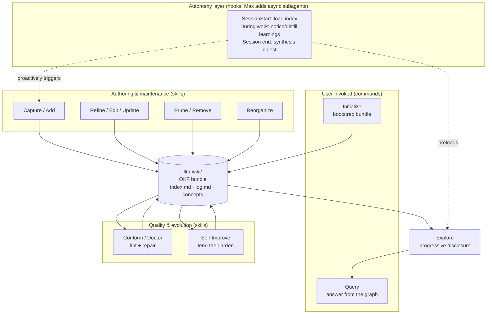
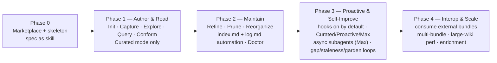

# Product Plan — `/llm-wiki`: an OKF-native LLM Wiki as a Claude Code Plugin

> Scope of this document: **product & behavior**, not implementation. It defines what the
> plugin is, who it's for, how it behaves, and the phased path to ship it. A separate
> technical plan will follow for each phase before code is written.

---

## Context

Foundation models are bottlenecked by *context*, not capability. The knowledge a coding agent
needs — architecture, conventions, runbooks, decisions, gotchas, the meaning of a metric — lives
scattered across code comments, wikis, chat history, and people's heads. Claude rediscovers the
same facts every session and forgets corrections between them.

Google's **Open Knowledge Format (OKF v0.1)** standardizes the "LLM-wiki" pattern: a directory of
markdown files with YAML frontmatter, where each file is a *concept*, the file path is its
identity, and markdown links form a knowledge graph. It is deliberately minimal — the only hard
requirement is a non-empty `type` field — and it is a *format, not a platform*: no SDK, no runtime,
portable across tools and orgs.

This is a near-perfect fit for Claude Code. As Karpathy notes, LLMs "don't get bored, don't forget
to update a cross-reference, and can touch 15 files in one pass" — the exact bookkeeping that makes
humans abandon wikis. **The product opportunity: a Claude Code plugin that lets Claude build and
tend a persistent, conformant OKF knowledge base for a project, so each session starts smarter than
the last.**

This repo (`public-skills`) currently holds only a README and LICENSE. It will become the **plugin
marketplace** that distributes `/llm-wiki`.

### Decisions locked with the user
- **Domain:** domain-agnostic core; **coding/engineering is the flagship use case** (ships as an optional starter pack, not hardcoded).
- **Autonomy:** **configurable per-install**, three modes — **Proactive is the default**, with a lighter "Curated" mode and a heavier "Max" mode.
- **Consumer side:** **producer-focused** — Claude reads/writes; humans use plain markdown/GitHub. No bundled viewer (for now).
- **CLAUDE.md:** the wiki is **independent** — the plugin does not read or modify CLAUDE.md/AGENTS.md.

---

## Vision & Goals

**Vision:** Every project Claude touches accumulates a living, portable knowledge base that makes
Claude measurably more accurate over time — owned by the user, readable by anyone, and interoperable
with the wider OKF ecosystem.

**Goals**
1. Claude can **author, maintain, and reason over** an OKF bundle with no manual markdown bookkeeping.
2. Everything the plugin writes is **OKF-conformant by construction** and portable to any OKF consumer.
3. The wiki **self-improves**: it captures learnings, detects gaps, prunes staleness, and strengthens its own graph.
4. Users control **how autonomous** Claude is, from fully curated to fully proactive.

**Non-goals (this phase):** a human-facing visualizer/graph UI; reading or rewriting CLAUDE.md; cloud
sync or hosted services; non-markdown storage backends; a fixed, opinionated type taxonomy.

---

## Personas

- **Solo builder / OSS maintainer** — wants project knowledge to persist across sessions and survive context resets.
- **Team engineer** — wants shared, reviewable, version-controlled knowledge that travels with the repo in a PR.
- **Data/analytics user** (secondary) — the original OKF audience: tables, metrics, join paths.

---

## Product Principles (inherited from OKF, adapted for Claude Code)

1. **Minimally opinionated.** Enforce only what OKF requires (parseable frontmatter + `type`). Everything else is guidance and templates the user can override.
2. **Conformant by construction.** The plugin should make it *hard* to produce a non-conformant bundle, and easy to repair one.
3. **Robust consumer.** Per the spec, never reject a third-party bundle for missing optional fields, unknown types, broken links, or missing indexes.
4. **The wiki is the source of truth, the context window is a cache.** Use OKF's `index.md` progressive disclosure to load only what's needed — never dump the whole wiki into context.
5. **Human-readable, agent-writable.** Same files, no translation layer. Reviewable in a normal diff.
6. **Portable by default.** A bundle is just files — shippable as a tarball, committable to git, consumable by Google's visualizer or any other OKF tool.

---

## The Wiki as a Product Surface

- **Location:** default `llm-wiki/` at the git repo root; user-configurable path at init. Lives in version control alongside the code it describes.
- **Shape (OKF v0.1):** a directory of concept files; each concept is one `.md` with YAML frontmatter (`type` required; `title`, `description`, `resource`, `tags`, `timestamp` optional) and a markdown body. File path = concept identity. Relative markdown links = the relationship graph.
- **Reserved files the plugin manages automatically:**
  - `index.md` per directory — progressive-disclosure listing so Claude can see what exists before opening files.
  - `log.md` per scope — change history, date-grouped newest-first, ISO `YYYY-MM-DD` headings.
- **Conformance guarantee:** every plugin-authored bundle satisfies OKF's three conformance rules. A "doctor" behavior validates and repairs human- or third-party-authored bundles.
- **Domain packs (extensibility):** optional starter taxonomies + templates. The **Engineering Pack** (flagship) seeds types like Architecture, Module/Component, Runbook, Decision (ADR), Convention, Gotcha, Glossary, Service, API. Packs are suggestions, never enforced.

---

## Core Capabilities (behaviors)

Each capability is described by *what the user experiences* and *what Claude does*. The Claude Code
surface (skill / command / hook) is noted at a **conceptual** level only — exact wiring is deferred
to the per-phase technical plans.

**Authoring & lifecycle**
- **Initialize** — bootstrap a conformant bundle at the chosen path, with root `index.md`, optional domain pack, and a `log.md`. One-time, user-invoked.
- **Capture (Add)** — turn a finding from the current work/conversation into a new concept doc: correct `type`, sensible frontmatter, body, links to related concepts, and a `log.md` entry. Refuses to create duplicates (offers to refine the existing concept instead).
- **Refine (Edit/Update)** — update an existing concept, refresh `timestamp`, append to `log.md`, and fix any links the change affects.
- **Prune (Remove)** — retire stale or duplicate concepts; repair inbound links; record the removal in `log.md`.
- **Reorganize** — restructure the directory/graph as the wiki grows (split overloaded files, regroup by type/domain), updating all relative links and regenerating affected `index.md` files.

**Retrieval & use**
- **Explore** — navigate via `index.md` progressive disclosure rather than reading everything; the primary mechanism that keeps context lean.
- **Query** — answer a user's question by traversing the graph, grounding the answer in concept docs, and citing the files used. When the wiki can't answer, it says so and flags a gap.

**Quality & evolution**
- **Conform / Doctor** — validate a bundle against OKF's three rules + house style; repair frontmatter, regenerate indexes, report (not auto-delete) broken links. Runs on demand and as a guardrail before writes.
- **Self-Improve** (see below).

---

## Autonomy Model (configurable per install)

A single setting chosen at install / via `/llm-wiki` config. **Proactive is the default**; users can
dial down to Curated or up to Max.

| Mode | Default? | Behavior |
|------|----------|----------|
| **Curated** | opt-down | Claude *proposes* additions/edits and asks before writing. User owns exactly what enters the KB. Hooks may load context but never write silently. |
| **Proactive** | ✅ **default** | Hooks are active. Claude writes to the wiki during/after work and records every change in `log.md`; the user reviews via diff/PR and can revert. Higher leverage, low friction. |
| **Max** | opt-up | Everything Proactive does, plus: Claude **dispatches async subagents** for heavy wiki operations (enrichment, multi-file capture, reorganization, tend-the-garden) so they run in the background without blocking the main task, and is steered to **distill aggressively** — surveying relevant knowledge *before* work, capturing decisions/findings *during* work, and running a thorough synthesis pass *after* work. Optimizes for the richest possible knowledge base at the cost of more tokens/agent activity. |

All modes guarantee: every write is conformant, every change is logged, nothing is destructive
without a recoverable trail.

**Why subagents in Max mode (product rationale):** distillation work is bursty and parallelizable —
drafting several concept docs, crawling a doc set to enrich citations, or running a full graph-health
pass would otherwise stall the user's foreground task and flood the main context window. Offloading
these to async subagents keeps the primary session responsive and its context lean, while the wiki
deepens in the background; results return as a reviewable digest. (Mechanics deferred to the
per-phase technical plan.)

---

## Self-Learning Mechanisms (behaviors)

The wiki should get better with use, not just bigger:

1. **Learn from corrections.** When the user corrects Claude, or Claude discovers something non-obvious during work, that becomes a candidate concept/edit (proposed in Curated, auto-captured + logged in Proactive).
2. **Gap detection.** When a Query can't be answered from the wiki, log the miss and offer to fill it.
3. **Staleness signals.** Use `timestamp` + `log.md` + the linked `resource` to flag concepts likely out of date (e.g., the code/file a concept describes changed).
4. **Graph health.** Surface orphan concepts (no inbound links), duplicate/near-duplicate concepts, and missing cross-links; propose merges and new links.
5. **Tend-the-garden pass.** An on-demand (later: scheduled) self-improvement review that dedupes, re-links, regenerates indexes, prunes, and produces a digest of what changed.
6. **Reinforcement.** Track which concepts get consulted/cited to prioritize what's worth keeping fresh and what's dead weight.

---

## Proactive Steering via Hooks

Hooks are **active by default** (Proactive and Max modes); Curated mode runs them in load-only,
never-write form:
- **SessionStart** — preload the root `index.md` (lightweight) so Claude knows the wiki exists and what's in it, without bloating context. In **Max**, Claude additionally surveys the concepts relevant to the session's task up front.
- **During work** — notice capture-worthy moments (corrections, discoveries, decisions) and queue them; **Max** distills continuously and may dispatch async subagents to draft concepts in the background.
- **Session end / Stop** — write (Proactive/Max) or offer (Curated) a digest of learnings into the appropriate concepts + `log.md`. **Max** runs a thorough post-work synthesis pass.

The product promise: hooks *steer Claude toward consulting and updating the wiki* — they never block the user or write destructively, and every write lands in `log.md` for review.

---

## Distribution & Install Experience

- This repo ships a **plugin marketplace** so users can add it and install `/llm-wiki`.
- After install, `/llm-wiki` (or a help/onboarding entry) explains the capabilities, runs **Initialize**, and lets the user pick path, domain pack, and autonomy mode.
- The plugin bundles the **OKF spec as a reference skill** so Claude always authors to v0.1 and can explain the format.

---

## Phased Roadmap (long-horizon)

- **Phase 0 — Foundation.** Marketplace entry + plugin skeleton; `/llm-wiki` discoverable; OKF v0.1 codified as a reference skill.
- **Phase 1 — Author & Read (MVP).** Initialize, Capture, Explore, Query, Conform — run in confirm-first form (the autonomy modes that flip this to default-Proactive arrive in Phase 3). Default `llm-wiki/`. *This is the smallest thing that delivers value.*
- **Phase 2 — Maintain.** Refine, Prune, Reorganize; automated `index.md`/`log.md`; the conformance Doctor as a guardrail.
- **Phase 3 — Proactive & Self-Improve.** Hooks on by default; the **Curated / Proactive (default) / Max** autonomy modes; **Max-mode async subagents** for background distillation; and the self-learning loops (corrections, gaps, staleness, tend-the-garden).
- **Phase 4 — Interop & Scale.** Robustly *consume* external/third-party OKF bundles, multiple bundles, large-wiki performance, optional enrichment passes (à la Google's reference agent).

---

## Success Metrics

- **Answerability:** % of project questions answered from the wiki vs. cold rediscovery.
- **Freshness:** stale-concept ratio trending down; time-since-update distribution.
- **Conformance:** 100% for plugin-authored bundles; Doctor repair rate for imported ones.
- **Learning:** repeated-correction rate declining over time (the wiki is absorbing feedback).
- **Reuse:** concepts consulted/cited per session; orphan ratio.
- **Adoption:** installs from the marketplace; bundles committed to repos.

---

## Risks & Open Questions

- **Context bloat** — loading too much wiki defeats the purpose. *Mitigation:* progressive disclosure via `index.md`; load summaries, open concepts on demand.
- **Capture noise** — over-eager additions create a junk drawer. *Mitigation:* Curated default; dedupe-before-create; tend-the-garden pruning.
- **Taxonomy drift** — domain-agnostic freedom can produce inconsistent `type`s. *Mitigation:* optional domain packs + Doctor's house-style checks (warn, don't enforce).
- **Link integrity at scale** — relative links break on reorg. *Mitigation:* link repair is a first-class behavior of Refine/Prune/Reorganize.
- **Open:** Should the tend-the-garden pass ever run on a schedule/loop, or always stay user-triggered? (Default: user-triggered; revisit in Phase 3.)
- **Open:** Multi-bundle / monorepo layout — one wiki per repo vs. per package? (Defer to Phase 4.)

---

## Verification (how we'll validate the product, per phase)

- **Dogfood** each phase on a real repo (e.g., this one): Initialize a bundle, Capture real findings, Query them back.
- **Conformance:** the Doctor must report the dogfooded bundle as 100% conformant to OKF v0.1's three rules.
- **Portability proof:** the resulting bundle renders correctly on GitHub and loads in Google's reference OKF visualizer with no edits — proving format-not-platform interop.
- **Answerability test:** a fixed question set answerable from the wiki after a session, but not before.
- **Autonomy test:** Curated mode never writes without confirmation; Proactive (default) writes are always reflected in `log.md` and reversible via git; **Max mode** dispatches background subagents without blocking the foreground task and returns a reviewable digest, with all writes still logged and reversible.

---

## Next Step After Approval

This product/behavior plan is the foundation. The immediate follow-up is a **Phase 0 + Phase 1
technical plan** (marketplace structure, plugin manifest, the specific skills/commands, and the
OKF-conformant file-writing behaviors) — written and reviewed before any code is committed.

---

## Future Ideas / Backlog (not committed to MVP/V1)

> A parking lot for ideas worth keeping but **not yet scheduled**. Inclusion here is *not* a
> commitment — each idea needs its own product/technical sizing before it earns a phase. We'll
> decide *where* and *when* to implement these as the core matures. Add freely; prune when an idea
> graduates into the roadmap or is explicitly dropped.

### 1. `/loop`-based autonomous curation job *(optional, opt-in)*

An optional skill that uses Claude Code's `/loop` to run a **recurring, self-paced background job**
that tends the `llm-wiki/` on a schedule rather than only in-session. One configured loop could
**curate, ingest, update, and review** the bundle: pull in capture-worthy material queued during the
day, run the tend-the-garden pass (dedupe, re-link, regenerate `index.md`, flag staleness), and emit
a digest of what changed for the user to review via diff/PR.

- **Why it's compelling:** decouples wiki maintenance from active coding sessions — the garden gets
  tended even when the user isn't working, and bursty distillation never competes with foreground work.
- **Relationship to existing plan:** this is the *scheduled/loop* answer to the open question in
  **Risks & Open Questions** ("Should the tend-the-garden pass ever run on a schedule/loop?") and a
  natural extension of **Max mode**'s async-subagent distillation. Likely a **Phase 3+** candidate.
- **Open questions:** cadence and self-pacing; how a loop job reconciles writes with concurrent
  in-session edits (lock? branch? queue?); how digests are surfaced and approved; guardrails so an
  unattended loop never makes destructive or non-conformant changes; cost ceiling per run.

### 2. Dedicated (smaller/cheaper) model for wiki curation *(configurable)*

Let the user assign a **specific model** to the wiki's curation/maintenance work — likely a smaller,
cheaper, faster model (e.g. Haiku) — distinct from the model driving the main coding session. Much of
the bookkeeping (regenerating `index.md`, appending `log.md`, frontmatter normalization, link repair,
dedupe/staleness scans, drafting routine concept stubs) is well-scoped and mechanical, so it doesn't
need the flagship model's reasoning and is cheaper to run often.

- **Why it's compelling:** makes proactive/loop-based curation economically cheap, so the wiki can be
  tended aggressively without burning premium tokens; aligns model cost with task difficulty.
- **Relationship to existing plan:** complements **Max mode**'s async subagents (give them the cheap
  model) and the **`/loop` curation job** above (cheap model = affordable to run on a schedule). A
  per-install or per-capability **model override** setting.
- **Open questions:** which operations are safe to delegate to a smaller model vs. which need the
  main model's judgment (e.g. deciding *what* is worth capturing, or a tricky reorganization);
  whether it's one global "curation model" or per-capability overrides; how to keep quality bars
  (conformance, no destructive edits) when a weaker model writes; escalation path when the small
  model is unsure; interaction with the user's configured default model.

### 3. Secret detection & redaction guardrail *(safety; likely a hook)*

A mechanism — most naturally a **`PreToolUse` / pre-write hook** — that scans content the plugin is
about to write into the `llm-wiki/` and **blocks or redacts** secrets: API keys, passwords, tokens,
private keys, connection strings, etc. Because the wiki captures findings from real working sessions
and lives in version control, it's a plausible place for a credential to leak in by accident. The
guardrail either refuses the write and surfaces what it found, or **anonymizes** the value in place
(e.g. replaces it with a `<REDACTED:type>` placeholder) before the file is committed.

- **Why it's compelling:** the wiki is meant to be portable and shared (committed, tarballed, handed
  to other OKF consumers) — a leaked secret is far more dangerous once it travels. Catching it *at
  write time* is the cheapest place to stop it.
- **Relationship to existing plan:** a new **safety guardrail** alongside the conformance **Doctor**
  (Doctor checks OKF-correctness; this checks for secrets). Should run regardless of autonomy mode,
  and is *especially* important for Proactive/Max writes and any unattended **`/loop`** curation,
  where a human isn't reviewing every write in the moment.
- **Open questions:** detection approach (regex/entropy heuristics vs. an existing scanner like
  `gitleaks`/`trufflehog` vs. a model pass) and whether to bundle a dependency; block-vs-redact
  default and whether it's user-configurable; false-positive handling and an allowlist/override;
  whether to also scan *imported/third-party* bundles on ingest; relationship to any repo-level
  pre-commit hooks the user already runs (avoid duplicating or fighting them).

---

### Sources
- [How the Open Knowledge Format can improve data sharing — Google Cloud Blog](https://cloud.google.com/blog/products/data-analytics/how-the-open-knowledge-format-can-improve-data-sharing/)
- [knowledge-catalog/okf/SPEC.md — GoogleCloudPlatform/knowledge-catalog](https://github.com/GoogleCloudPlatform/knowledge-catalog/blob/main/okf/SPEC.md)
- [knowledge-catalog/okf — GitHub](https://github.com/GoogleCloudPlatform/knowledge-catalog/tree/main/okf)
- [Open Knowledge Format — Grounding Page](https://groundingpage.com/facts/open-knowledge-format/)
- [Google's OKF wants to be the lingua franca for AI agent knowledge — ppc.land](https://ppc.land/googles-okf-wants-to-be-the-lingua-franca-for-ai-agent-knowledge/)
</content>
